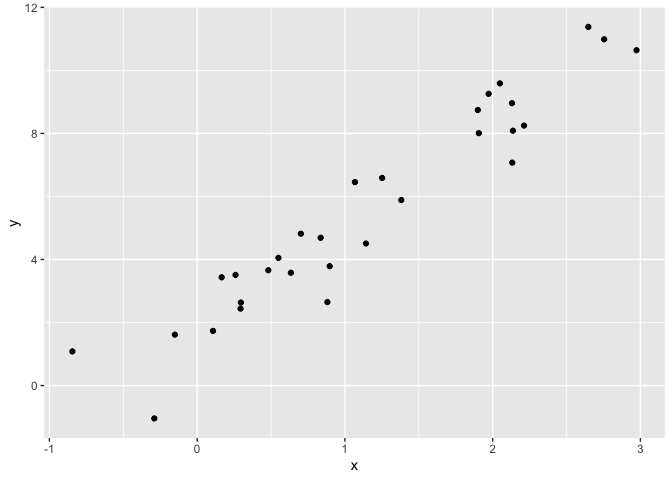

Writing Functions
================
Lizbeth Gomez
10/24/2019

Class slides at [Session 15 - Writing
functions](https://p8105.com/writing_functions.html) Some notes from the
slides: functions have: Arguments (input) body (code) return (fucntion’s
product)

Conditional execution: proper fornmating of if statements

## Getting started

writing fucntions

``` r
x= rnorm (n=30, mean =4, sd =2.3)
x_again= rnorm (n=30, mean =6, sd =.3)
y= rnorm (n=30, mean =24, sd =.3)
(x- mean(x))/ sd(x)
```

    ##  [1] -0.62716532 -1.60912297 -0.04441855  0.83841556 -1.11219869
    ##  [6]  1.31856661 -2.13510658 -0.55354096  0.13533240 -0.92419033
    ## [11]  0.43031144 -0.71891708  0.46665126  1.39342009 -0.85532204
    ## [16]  2.44914260 -0.11552069  0.71713598  0.40738367  1.43626227
    ## [21]  0.57524918 -1.15528958  0.58517861  0.51030446 -0.11352069
    ## [26]  0.40827142  0.08475081  0.09656926 -0.98694604 -0.90168608

``` r
(x_again- mean(x_again))/ sd(x_again)
```

    ##  [1]  0.2623281 -2.2264181  0.6479063 -0.2444569 -0.8751761  0.3681468
    ##  [7] -1.2929355 -0.0424370  1.8306354  0.3902769 -1.4541081  0.5307920
    ## [13] -0.2090461 -1.0920916 -0.7694520  1.2517074  0.5983436  0.3983023
    ## [19]  1.5361104  1.0728376  0.9042976 -1.8822513 -1.0649508  0.7309393
    ## [25]  0.1542408 -0.1001877 -0.0650134  0.8656783 -0.7268320  0.5028139

Now a fucntion: the x argument insude the fucntion even if there is an x
in the environment the x will be from the function

``` r
z_scores = function(x) {
  
  if(!is.numeric(x)) {
    stop("x should be numeric")
  } else if (length(x <3)) {
    stop("x should be longer than 3")
  }
  
  (x - mean(x)) / sd(x)
  
  
}
```

Trying out the
    function

``` r
z_scores(x=3)
```

    ## Error in z_scores(x = 3): x should be longer than 3

``` r
z_scores (x=y)
```

    ## Error in z_scores(x = y): x should be longer than 3

``` r
z_scores ("my name is liz")
```

    ## Error in z_scores("my name is liz"): x should be numeric

``` r
z_scores (x = c(TRUE, TRUE, FALSE, TRUE))
```

    ## Error in z_scores(x = c(TRUE, TRUE, FALSE, TRUE)): x should be numeric

``` r
z_scores(x= iris)
```

    ## Error in z_scores(x = iris): x should be numeric

## multiple outputs

no lists for now

``` r
mean_and_sd = function(input_x) {
  
  if (!is.numeric(input_x)) {
    stop("Argument x should be numeric")
  } else if (length(input_x) < 3) {
    stop("Cannot be computed for longer than 3")
  }
  
  mean_x = mean(input_x)
  sd_x = sd(input_x)

  list(mean = mean_x, 
       sd = sd_x)
}
```

\#multiple inputs

``` r
sim_data = tibble(
  x = rnorm(30, mean = 1, sd = 1),
  y = 2 + 3 * x + rnorm(30, 0, 1)
)
sim_data %>%  ggplot (aes(x=x, y=y)) +geom_point()
```

<!-- -->

``` r
ls_fit = lm(y ~ x, data = sim_data)
  
beta0_hat = coef(ls_fit)[1]  # intercept
beta1_hat = coef(ls_fit)[2]  # slope
```

``` r
sim_regression = function(n, beta0, beta1) {
  
sim_data = tibble(
  x = rnorm(n, mean = 1, sd = 1),
  y = beta0 + beta1 * x + rnorm(n, 0, 1)
)

ls_fit = lm(y ~ x, data = sim_data)
tibble(
  beta0_hat = coef(ls_fit)[1],  # intercept
  beta1_hat = coef(ls_fit)[2]  # slope
)
}

sim_regression(n=3000, beta0 = 17, beta1 = -3)
```

    ## # A tibble: 1 x 2
    ##   beta0_hat beta1_hat
    ##       <dbl>     <dbl>
    ## 1      17.0     -3.01

``` r
sim_regression(n=3000, beta0 = 17, beta1 = -3) # can change some of the arguments and not others, as well as write them in oder without haveing to equal the variables
```

    ## # A tibble: 1 x 2
    ##   beta0_hat beta1_hat
    ##       <dbl>     <dbl>
    ## 1      17.0     -3.02

# Scrape lots of Napoleon

``` r
read_page_reviews <- function(url) {
  
  h = read_html(url)

dynamite_html = read_html(url)

review_titles = dynamite_html %>%
  html_nodes("#cm_cr-review_list .review-title") %>%
  html_text()

review_stars = dynamite_html %>%
  html_nodes("#cm_cr-review_list .review-rating") %>%
  html_text()

review_text = dynamite_html %>%
    html_nodes(".review-data:nth-child(4)") %>%
    html_text()

reviews = tibble(
  title = review_titles,
  stars = review_stars,
  text = review_text
)
reviews
}
```

``` r
read_page_reviews("https://www.amazon.com/product-reviews/B00005JNBQ/ref=cm_cr_arp_d_viewopt_rvwer?ie=UTF8&reviewerType=avp_only_reviews&sortBy=recent&pageNumber=1")
```

    ## # A tibble: 10 x 3
    ##    title                           stars         text                      
    ##    <chr>                           <chr>         <chr>                     
    ##  1 "Gotta watch it!\n            " 5.0 out of 5… Format: Prime VideoVerifi…
    ##  2 "Great movie\n            "     5.0 out of 5… Format: Blu-rayVerified P…
    ##  3 "Duh\n            "             5.0 out of 5… Format: Prime VideoVerifi…
    ##  4 "Great video\n            "     5.0 out of 5… Format: DVDVerified Purch…
    ##  5 "Give me some of your tots\n  … 5.0 out of 5… Format: Prime VideoVerifi…
    ##  6 "Nostalgic\n            "       5.0 out of 5… Format: Prime VideoVerifi…
    ##  7 "Make you giggle type movie\n … 5.0 out of 5… Format: Blu-rayVerified P…
    ##  8 "This movie is so stupid.\n   … 5.0 out of 5… Format: Prime VideoVerifi…
    ##  9 "Hilarious\n            "       5.0 out of 5… Format: Prime VideoVerifi…
    ## 10 "Waste of money\n            "  1.0 out of 5… Format: Prime VideoVerifi…

``` r
read_page_reviews("https://www.amazon.com/product-reviews/B00005JNBQ/ref=cm_cr_arp_d_viewopt_rvwer?ie=UTF8&reviewerType=avp_only_reviews&sortBy=recent&pageNumber=2") #page 2
```

    ## # A tibble: 10 x 3
    ##    title                               stars        text                   
    ##    <chr>                               <chr>        <chr>                  
    ##  1 "Good movie\n            "          5.0 out of … Format: Prime VideoVer…
    ##  2 "A classic\n            "           5.0 out of … Format: Prime VideoVer…
    ##  3 "FRIKKEN SWEET MOVIE, GAWSH.\n    … 5.0 out of … Format: Prime VideoVer…
    ##  4 "You gonna eat the rest of your to… 5.0 out of … Format: Prime VideoVer…
    ##  5 "Tina you fat lard come get some d… 5.0 out of … Format: Prime VideoVer…
    ##  6 "Great family movie\n            "  5.0 out of … Format: Blu-rayVerifie…
    ##  7 "Teens love it\n            "       5.0 out of … Format: Prime VideoVer…
    ##  8 "Great\n            "               5.0 out of … Format: DVDVerified Pu…
    ##  9 "Great Movie, Bad Packaging\n     … 4.0 out of … Format: Blu-rayVerifie…
    ## 10 "jeez napoleon\n            "       5.0 out of … Format: Prime VideoVer…

``` r
read_page_reviews("https://www.amazon.com/product-reviews/B00005JNBQ/ref=cm_cr_arp_d_viewopt_rvwer?ie=UTF8&reviewerType=avp_only_reviews&sortBy=recent&pageNumber=3") #page 3
```

    ## # A tibble: 10 x 3
    ##    title                             stars         text                    
    ##    <chr>                             <chr>         <chr>                   
    ##  1 "👍\n            "                5.0 out of 5… Format: Prime VideoVeri…
    ##  2 "A classic!\n            "        5.0 out of 5… Format: DVDVerified Pur…
    ##  3 "A must own\n            "        5.0 out of 5… Format: Prime VideoVeri…
    ##  4 "If you like 80s ...you must wat… 5.0 out of 5… Format: Prime VideoVeri…
    ##  5 "🤘\n            "                5.0 out of 5… Format: Prime VideoVeri…
    ##  6 "Super Slow Mooovie...\n        … 1.0 out of 5… Format: Prime VideoVeri…
    ##  7 "Awesome!\n            "          5.0 out of 5… Format: Prime VideoVeri…
    ##  8 "Very funny\n            "        4.0 out of 5… Format: Prime VideoVeri…
    ##  9 "Eat your food tina\n           … 5.0 out of 5… Format: Prime VideoVeri…
    ## 10 "Dumb funny\n            "        5.0 out of 5… Format: DVDVerified Pur…

\#Funtions a arguments

``` r
x = rnorm(25, 0, 1)

my_summary = function(x, summ_func) {
  summ_func(x)
}


my_summary(x, sd)
```

    ## [1] 0.9956099

``` r
my_summary(x, IQR)
```

    ## [1] 1.029099

``` r
my_summary(x, var)
```

    ## [1] 0.9912391

\#Scoping and names

``` r
f = function(x) {
  z = x + y
  z
}

x = 1
y = 2

f(x = y)
```

    ## [1] 4
